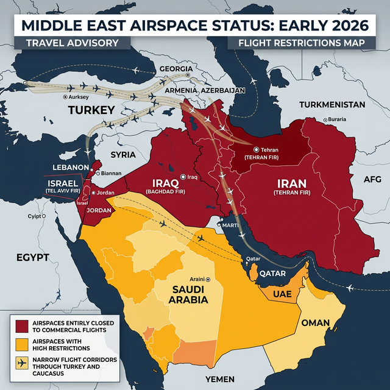

> **Important:** This is a dynamic situation. Airspace restrictions and airline schedules are changing daily. Always verify your flight status directly with your carrier and check official government travel advisories before departing.

## Executive Summary

The recent conflict (starting February 28, 2026) has ground much of the Persian Gulf and Arab airspace to a halt. Dozens of countries—including Iran, Iraq, Israel, Saudi Arabia, Kuwait, the UAE, and Qatar—have closed or severely restricted their airspace. 

This has effectively severed the normal Europe–Asia flight corridors. Airlines must now thread through a narrow "Caucasus" corridor via Turkey, Armenia, and Azerbaijan or take much longer southern detours via Africa and the Red Sea. The fallout includes thousands of cancellations, several hours of extra flying time per trip, and significant fuel price hikes. For example, a Delhi–London flight that normally took ~10 hours now often exceeds 11.5 hours.

*Fig 1: Estimated airspace closures and restrictions across the Middle East as of March 2026.*

## Airspace Closures & Restrictions (as of March 9, 2026)

### Iran and Nearby Flight Information Regions (FIRs)
After strikes on February 28, the **Iranian FIR (OIIX/Tehran)** was closed entirely to civil traffic. **Iraq’s FIR (ORBB/Baghdad)** followed suit. Adjacent regions including Jordan, Syria, Kuwait, Bahrain, and Oman are either fully closed or under strict ESCAT (Emergency Security Control of Air Traffic) controls. The **Tel Aviv FIR (LLLL)** remains essentially closed to civil traffic except for rare special rescue flights. 

European aviation safety authorities (EASA) have advised against all flights in these zones through at least March 11.

### Gulf States Hubs
Initially, major hubs like **Dubai (DXB/DWC)**, **Abu Dhabi (AUH)**, and **Doha (DOH)** were completely shut down. 
- **Dubai:** Reopened on March 2 for highly limited repatriation and cargo flights only. As of March 5–6, Emirates began resuming a "limited schedule" of about 100 flights.
- **Abu Dhabi:** Etihad resumed limited operations to ~70 destinations on March 6, primarily for repatriation.
- **Doha:** Qatar Airways remains largely suspended as the hub remains closed into early March.

### Nearby Regions
- **Pakistan:** Remains off-limits to many Western and Indian flights (a continuation of restrictions since 2022).
- **Caucasus Corridor:** On March 5, drone activity near the Baku FIR prompted temporary closures, further tightening the remaining narrow sliver of "safe" sky between Russia and Iran.

## Airlines Affected & Routing Changes

Airlines worldwide are scrambling to find alternate routes. Below is the current status of major carriers:

| Airline | Primary Impact | Status & Routing Changes |
| :--- | :--- | :--- |
| **Emirates** | Europe/Asia via Dubai | Operating limited schedule (repatriation/cargo only). Restricted corridors in use since March 5. |
| **Etihad** | Europe/US via Abu Dhabi | Limited schedule resumed March 6 to ~70 destinations (London, Paris, Delhi, New York). |
| **Qatar Airways** | Global via Doha | All commercial flights suspended until further notice. Hub remains closed. |
| **Air India** | Europe & N. America | Adding 78 extra flights (Mar 10–18). Using detours (e.g., Delhi–New York stopping in Rome). |
| **IndiGo** | Europe (via Norse) | Grounded until corridors reopen. One resume flight (Mar 8) went far south via Africa/Egypt (+1.5h). |
| **Finnair** | Europe–Asia | Cancelled Doha/Dubai flights. Routing via far north or Pacific to avoid conflict zones. |
| **Lufthansa** | ME & Asia | Suspended Tel Aviv/Beirut to Mar 22/28. Asia routes detouring via Russia/Central Asia. |
| **British Airways** | ME & Asia | Cancelled Gulf routes through Mar 7. Asia flights detouring via Cairo and Cyprus. |

## Routes, Rerouting & Distance Impacts

With the Persian Gulf corridor blocked, airlines must choose between two primary detours, both of which add significant time and cost:

1.  **Northern/Caucasus Route:** Flights from Asia head northwest over Kazakhstan/Central Asia, then south through a narrow "100-mile-wide sliver" in the Caucasus (Armenia/Georgia/Azerbaijan) into Europe. This corridor is currently extremely congested.
2.  **Southern (Africa/Red Sea) Route:** Flights track south of the conflict zone, over the Arabian Sea, around the horn of Africa, and up through the Red Sea and Egypt. An IndiGo flight from Mumbai to London recently used this route, adding roughly an hour to the total flight time.

**The Cost Factor:** Every extra hour aloft burns approximately 5 tonnes of jet fuel. With fuel prices spiking over 50% since the conflict began, these detours are adding roughly $5,000–$10,000 in additional costs per widebody flight.

## Passenger Implications: What to Expect

### Cancellations & Delays
Expect a high volume of grounded flights. Even if your flight is operating, the alternate routing may add 10–15% more flying time. Airlines are prioritizing repatriation, meaning leisure travel may face lower priority for rebooking.

### Missed Connections & Baggage
Longer flight times mean tighter connection windows. If your first leg is delayed due to rerouting, you are likely to miss your onward flight. Baggage handling is also under strain; it is highly recommended to carry essential medications and a change of clothes in your carry-on.

### Insurance & Refunds
Because the conflict was declared a "known event" by February 28, most travel insurance policies purchased *after* that date will **not** cover disruptions related to this war. If you bought your policy earlier, you may be covered—check your specific policy wording for "War and Civil Unrest" clauses.

## Practical Traveler Tips

  <strong>Stay Prepared:</strong>
  <ul>
    <li><strong>Check Status Hourly:</strong> Don't rely on old emails. Use the airline's mobile app for live tracking.</li>
    <li><strong>Add Buffer:</strong> Book connections with at least 3–4 hours of layover time.</li>
    <li><strong>Flexible Routing:</strong> Consider "eastward" routes (via China/Japan/USA) as an alternative for Asia–Europe travel.</li>
    <li><strong>Luggage:</strong> Photograph your bags and contents before checking them in case of loss.</li>
    <li><strong>Visa Rules:</strong> New routes might involve technical stops or transits in countries like Azerbaijan, Turkey, or Egypt. Verify if you need a transit visa.</li>
  </ul>

## Timeline of Key Events (2026)

- **Feb 28:** Initial strikes trigger immediate regional airspace closures (Iran, Iraq, Israel).
- **Mar 01:** India's DGCA warns carriers to avoid 11 FIRs; over 350 flights cancelled in one day.
- **Mar 02:** UAE allows limited "rescue only" flights from Dubai; Oman issues restrictive NOTAM.
- **Mar 04:** Industry experts report "no usable Gulf corridor" for commercial transit.
- **Mar 05:** Drone strikes near Baku (Azerbaijan) temporarily close southern Caucasus FIR.
- **Mar 06:** Emirates and Etihad resume "limited skeleton schedules" for stranded travelers.
- **Mar 08:** Air India announces massive temporary capacity boost to handle the passenger backlog.
- **Mar 10:** Current status: Airspace remains highly restricted; most Asia–Europe flights detouring.

---

*This guide is updated regularly based on official NOTAMs, EASA advisories, and carrier statements. Last updated: March 10, 2026. This content is for educational guidance only and does not constitute legal or travel insurance advice.*

**Author: Patricia Azevedo, Visa & Travel Strategy Consultant | [About the Author](/about-us/)**

[→ Stuck with a cancelled flight and need an alternate plan? Our Itinerary Building service can help.](/services/itinerary-building/)

[→ Need help with a flight cancellation or refund? Check our Europe Travel Insurance guide.](/blog/europe-travel-insurance/)
